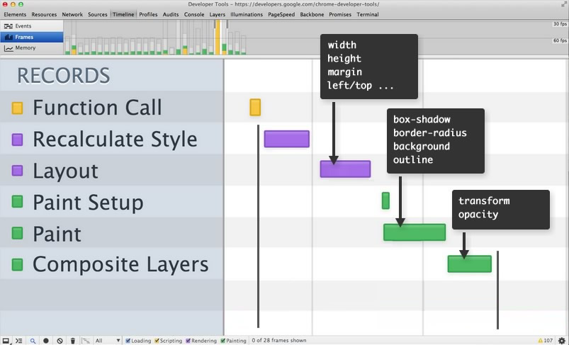
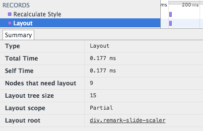
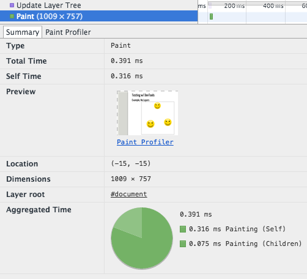

class: center, middle, title-slide
![Layers graphic][layers]
# Performant Animations with Layers
## NOTE: Work in Progress
**By Will Hastings**

[layers]: images/layers.jpg

???

* Me: Web Dev, Horizontal
* Talk about:
  * Browser rendering cycle
  * GPU layers: What? Kinds of animations?
  * Dev tools: Check for layers, measure performance
  * Animation demo: w/ and w/o layers

---

class: slide-short
# Our Goal

* Smooth animations at 60 FPS
  * Constraint: ≈ 16ms for JS + render cycle
  * Rerender waits for JS (don't block it!)

???

* Goal: 60 fps
* Only 16ms! (JS and render)
* Don't block!
  * Dropped frames
  * Janky animations

---

class: rendering-cycle, slide-med
# Browser Rendering Cycle

.col-one-third[
* Steps:
  * (Re)calculate styles
  * Layout (dimensions and positions)
  * Paint (to layers)
  * Composite Layers
* Can sometimes skip step(s) (layout, paint)
* Fewer steps = better perf
]
.col-two-third[

.img-caption[
  **Source:** [High Performance Animations][hp_anim]
]
]

???

* Steps to render...
* Recalc style whenever styles change
* Layout: Calc size and position
* Paint: Draw pixels to layers
* Composite: Flatten layers for display
* Not all required
* Fewers steps = better perf

---

class: slide-med
# Browser Rendering Cycle
## Layout

.col-half[
* a.k.a. reflow
* Calculate geometry of changed elements
* Layout can also affect:
  * Child elements
  * Neighboring elements
* Quickly becomes *expensive*
* Props that trigger:
  * width
  * position
  * margin
  * More: [csstriggers.com][triggers]
]

.col-half[

]

[triggers]: http://csstriggers.com/

???

* reflow
* Size and position
* Expensive:
  * Element itself
  * Children
  * Neighbors
* Avoid animating props that trigger
  * See CSS triggers

---

class: slide-med
# Browser Rendering Cycle
## Paint

.col-half[
* Painting can be *slowwwwwwww*
* Goal: Don't paint or paint as small of area as possible
  * Browser draws smallest rectangle encompassing areas to paint
* Props that trigger:
  * color
  * background
  * box-shadow
  * More: [csstriggers.com][triggers]
* Triggering layout will probably also cause paint
]

.col-half[

]

???

* Expensive
* Try to avoid/minimize
  * Avoid wide paint area (e.g. two corners of screen)
* Certain props trigger
  * Anything related to colors
  * Some really expensive: box-shadow, gradient backgrounds
* Layout usually = paint

---

class: slide-med
# Browser Rendering Cycle
## Composite Layers

.col-half[
* Browser paints to layers (like Photoshop's)
* Sends them to GPU
* GPU *composites* (flattens) them
  * But can do (animate) some things before this
  * GPU animations are *fast*
* Then ready for drawing
]

.col-half[

]

???

* Paint to layers
* Upload to GPU
* GPU composites... one image
* Browser draws to screen
* Want to animate here

---

class: slide-med
# Using Layers

* Can cheaply animate position, scale, rotation and opacity.
  * `transform: translate(...);`
  * `transform: scale(...);`
  * `transform: rotate(...);`
  * `opacity: 0...1;`
* Need to create layer for animated element
  * Just using `transform` or `opacity` in an animaton doesn't guarantee layer
    creation
* Classic way: `transform: translateZ(0)` or `transform: translate3d(0, 0, 0)`
  * Forces creation
  * Don't go [too crazy with it][apple_home]...
* New way: `will-change: transform, opacity;`
* Sometimes automatic:
  * e.g. CSS3 animation changing position/scale/rotation/opacity

???

* animations of `transform` and `opacity` done on GPU
  * Very efficient: Move around, Resize, Rotate, Change transparency
  * These props don't trigger layout
  * Can avoid paint w/ own layer
* Have to get element on layer
* Hack: `translateZ(0)` or `translate3d(0, 0, 0)`
  * Forces
  * Can be overdone (e.g. Apple home carousel)
* `will-change`
  * Tell browser what you'll change
  * It can optimize
    * e.g. Creating layer
  * See article in Resources

[apple_home]: http://wesleyhales.com/blog/2013/10/26/Jank-Busting-Apples-Home-Page/

---

class: slide-med
# Simple Layers Example

.col-half[
```css
.simple-ex {
  background-color: red;
  height: 100px;
  opacity: 0.5;
  transition: transform .5s ease-in,
    opacity .5s ease-in;
  transform: translate3d(0, 0, 0);
  width: 100px;
}

.simple-ex:hover {
  opacity: 1;
  transform: translate3d(25px, 45px, 0)
    rotate(45deg);
}
```
]
.col-half[
  .simple-ex[]
]

???

* Use `transition` to specify props to animate
* Start w/ `transform: translate3d(0, 0, 0)` for layer
* Animate opacity, position, and rotation

---

# Testing w/ DevTools
## Checking for Layers and Painting

0. Open DevTools
0. Turn on `Show paint rectangles`
0. Turn on `Show composited layer borders`
0. Check for layer and (absence of) painting

![Rendering checkboxes][rendering_checks]

[rendering_checks]: images/rendering_checks.png

???

* Press ESC, then Rendering tab
* "Paint rectangles" show every paint
* "Layer borders" draws borders around layers

---

# Testing w/ DevTools
## Profiling Performance

.col-one-third[
0. Open DevTools
0. Go to **Timeline** Tab
0. Turn on **Frames view** is on.
0. Check *Paint* in **Capture**
0. Start recording (hint: Command + r)
0. Trigger animation (if needed)
0. Stop recording
0. Look for frames less than 60 fps
0. Look for long JS, layout, paints
]

.col-two-third[
![Checking Perf with DevTools][perf_check]
]

[perf_check]: images/perf_check.png

???

* In Timeline
* Turn on Frames View
* Capture Paint
* Record
* Animate
* Stop record
* Examine
  * Look for slow frames
  * Look for excess paint and layout

---

# Testing w/ DevTools
## Example, No Layers

.ex.ex-1[
  .ex-1-el[]
  .ex-1-el[]
  .ex-1-el[]
]

???

* CSS3 animation:
  * Top and left
  * width and height
  * background-size
* DEVTOOLS
  * Constant repainting
  * Relayout
  * No layers

---

# Testing w/ DevTools
## Example, Layers

.ex.ex-2[
  .ex-2-el[]
  .ex-2-el[]
  .ex-2-el[]
]

???

* CSS3 animation:
  * `transform: translate(...) scale(...)`
* DEVTOOLS
  * Layers
  * No painting
  * No layout

---

class: slide-med
# Resources

* [High Performance Animations][hp_anim]
* [Optimising for 60fps everywhere][60_everywhere]
* [Pixels are expensive][pixels_exp]
* [Performant CSS Animations][perf_anims]
* [Delivering 60 FPS in the browser][60_browser]
* [Everything You Need to Know About the CSS will-change Property][will_change]
* [JankFree.org][jf]

[hp_anim]: http://www.html5rocks.com/en/tutorials/speed/high-performance-animations/
[jf]: http://jankfree.org/
[60_everywhere]: https://engineering.gosquared.com/optimising-60fps-everywhere-in-javascript
[pixels_exp]: https://aerotwist.com/blog/pixels-are-expensive/
[will_change]: http://dev.opera.com/articles/css-will-change-property/
[perf_anims]: http://eng.wealthfront.com/2015/05/performant-css-animations.html
[60_browser]: https://www.youtube.com/watch?v=rpNXWxMyzHQ

???

* More optimizations (e.g. avoiding layout thrashing)
